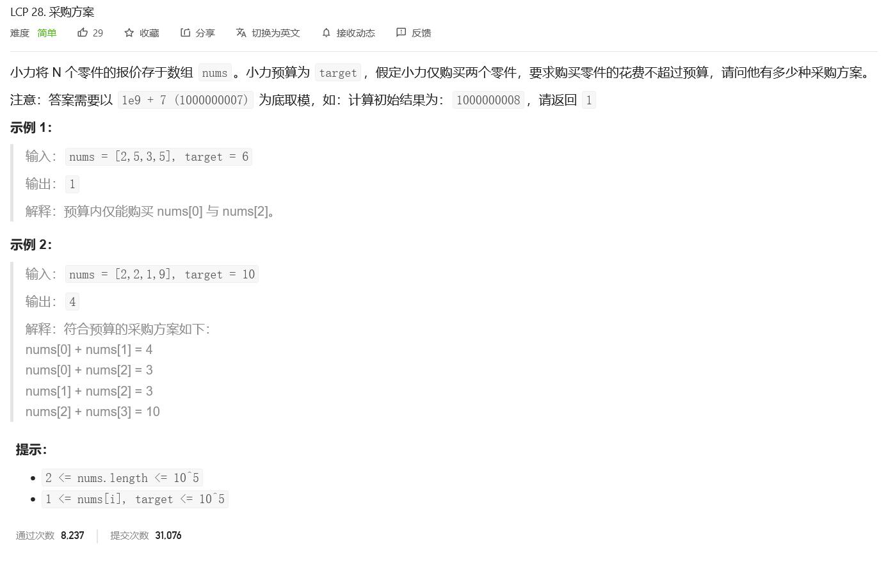
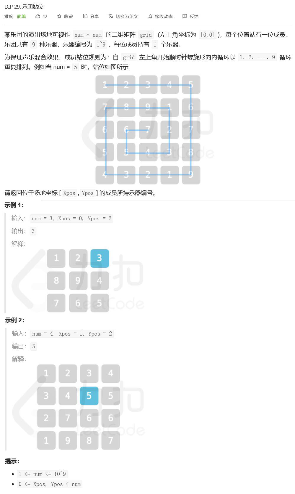
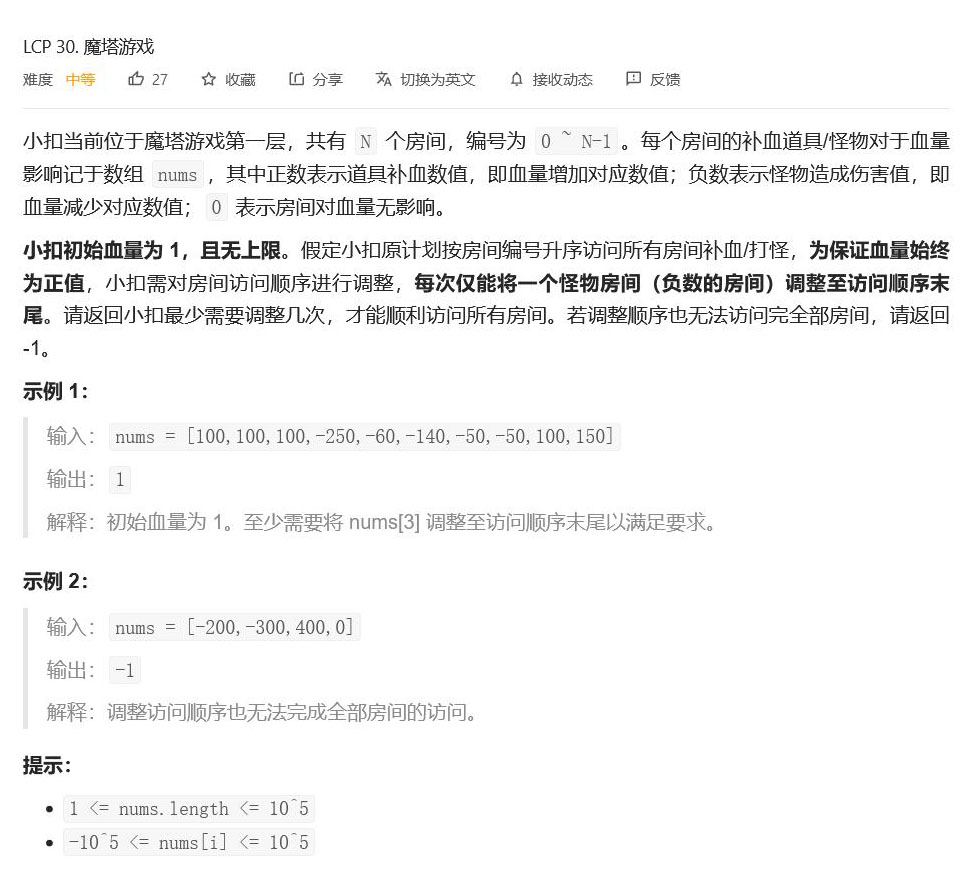

## LCP 28. 采购方案



#### 方法一：暴力（超时）

直接两重循环，遍历数组

```python
def purchasePlans(nums, target):
    """采购方案"""
    count = 0
    for i in range(len(nums)):
        for j in range(i + 1, len(nums)):
            if nums[i] + nums[j] <= target:
                count += 1
    return count
```

#### 方法二：排序+双指针

- 先将数组排序，然后采用双指针
- `start`和`end`分别从左边和右边遍历，
- 找到第一个对应的`end`使得`nums[start]+nums[end]<=target`，代表和`nums[start]`一起采购的方案有`end - start`个

```python
def purchasePlans(nums, target):
    nums.sort()
    count = 0
    # print(nums)
    for start in range(len(nums)):
        for end in range(len(nums) - 1, start, -1):
            if nums[start] + nums[end] <= target:
                count += (end - start)
                count %= 1000000007
                # print(str(end) + ' - ' + str(start))
                break
    return count
```

上面的代码超时，本质上还是两层循环，不超时的写法如下

```python
def purchasePlans(nums, target):
    nums.sort()
    ans = 0
    i = 0
    j = len(nums) - 1
    while i < j:
        if nums[i] + nums[j] > target:
            j -= 1
        else:
            ans += (j - i)
            i += 1
    if ans <= 1000000007:
        return ans
    else:
        return ans % 1000000007
```

> sorted(nums)方法会对nums进行排序，然后生成新的序列但不会改变nums原来的顺序，nums.sort()会直接对nums进行排序

## LCP 29. 乐团站位



#### 方法一：模拟查找

参考[题解](https://leetcode-cn.com/problems/SNJvJP/solution/san-ju-hua-rang-li-kou-wei-wo-bao-long18-2nsi/)

```python
def orchestraLayout(num: int, xPos: int, yPos: int):
    # 先确定这个位置在第几圈, circle从0开始计数，即第“一”圈为circle == 0
    circle = min(xPos, yPos, num - 1 - xPos, num - 1 - yPos)
    # 记录第circle圈的边长，边长为正方形边长 - 1，每圈过后边长减2
    l = num - 1 - 2 * circle
    count = num * num - (l + 1) * (l + 1)

    if xPos == circle and yPos < num - 1 - circle:
        # 上边
        count += yPos - circle + 1
    elif yPos == num - 1 - circle and xPos < num - 1 - circle:
        # 右边
        count += l + xPos - circle + 1
    elif xPos == num - 1 - circle and yPos > circle:
        # 下边
        count += 2 * l + num - circle - yPos
    else:
        count += 3 * l + num - circle - xPos

    return 9 if count % 9 == 0 else count % 9
```

## LCP 30. 魔塔游戏



方法一：堆排序

[题解](https://leetcode-cn.com/problems/p0NxJO/solution/lcp-30-mo-ta-you-xi-biao-zhun-de-xiao-ge-4gkk/)

```python
import heapq

class Solution:
    def magicTower(self, nums):
        if sum(nums) < 0: 
            return -1
        hurts = []
        blood = 0
        counts = 0
        heapq.heapify(hurts)
        for i in nums:
            blood += i
            if i < 0:
                heapq.heappush(hurts, i)   
            if blood < 0:
                counts += 1
                blood -= heapq.heappop(hurts)
        return counts
```

## LCP 31. 变换的迷宫

某解密游戏中，有一个 N\*M 的迷宫，迷宫地形会随时间变化而改变，迷宫出口一直位于 `(n-1,m-1)` 位置。迷宫变化规律记录于 `maze` 中，`maze[i]` 表示 `i` 时刻迷宫的地形状态，`"."` 表示可通行空地，`"#"` 表示陷阱。

地形图初始状态记作 `maze[0]`，此时小力位于起点 `(0,0)`。此后每一时刻可选择往上、下、左、右其一方向走一步，或者停留在原地。

小力背包有以下两个魔法卷轴（卷轴使用一次后消失）：
+ 临时消除术：将指定位置在下一个时刻变为空地；
+ 永久消除术：将指定位置永久变为空地。

请判断在迷宫变化结束前（含最后时刻），小力能否在不经过任意陷阱的情况下到达迷宫出口呢？

**注意： 输入数据保证起点和终点在所有时刻均为空地。**

**示例 1：**
>输入：`maze = [[".#.","#.."],["...",".#."],[".##",".#."],["..#",".#."]]`
>
>输出：`true`
>
>解释：


**示例 2：**
>输入：`maze = [[".#.","..."],["...","..."]]`
>
>输出：`false`
>
>解释：由于时间不够，小力无法到达终点逃出迷宫。

**示例 3：**
>输入：`maze = [["...","...","..."],[".##","###","##."],[".##","###","##."],[".##","###","##."],[".##","###","##."],[".##","###","##."],[".##","###","##."]]`
>
>输出：`false`
>
>解释：由于道路不通，小力无法到达终点逃出迷宫。

**提示：**
- `1 <= maze.length <= 100`
- `1 <= maze[i].length, maze[i][j].length <= 50`
- `maze[i][j]` 仅包含 `"."`、`"#"`

#### 方法一：双向bfs

[题解](https://leetcode-cn.com/problems/Db3wC1/solution/python3-shuang-xiang-bfsmei-hao-de-shuan-e2ea/)

```python
class Solution:
    def escapeMaze(self, maze: List[List[str]]) -> bool:
        time = len(maze)
        n, m = len(maze[0]), len(maze[0][0])
        if n + m - 2 > time:
            return False
        best = [[[[float('inf'), -1] for i in range(2)] for k in range(m)] for j in range(n)]
        record = [[[[float('inf')] * 2 for k in range(m)]
                   for j in range(n)] for i in range(time)]
        best[0][0][0][0] = 0
        best[n - 1][m - 1][0][1] = time - 1
        record[0][0][0][0] = int(maze[0][0][0] == '#')
        record[time - 1][n - 1][m - 1][1] = int(maze[time - 1][n - 1][m - 1] == '#')
        road = [(0, 0), (0, 1), (1, 0), (0, -1), (-1, 0)]
        z1 = [(0, 0, 0)]
        z2 = [(time - 1, n - 1, m - 1)]
        i, j = 0, 0

        while i < len(z1) or j < len(z2):
            if i < len(z1):
                t, x, y = z1[i]
                if t < time:
                    for a, b in road:
                        o, p = x + a, y + b
                        if -1 < o < n and -1 < p < m and n + m - o - p <= time - t:
                            if not record[t][x][y][0] and max(best[o][p][0][1], best[o][p][1][1]) > t:
                                return True
                            if record[t][x][y][0] and best[o][p][0][1] > t:
                                return True
                            if maze[t + 1][o][p] == '#':
                                if not record[t][x][y][0] and record[t + 1][o][p][0] > 1:
                                    record[t + 1][o][p][0] = 1
                                    z1.append((t + 1, o, p))
                                    best[o][p][0][0] = min(best[o][p][0][0], t + 1)
                            else:
                                if record[t + 1][o][p][0] > record[t][x][y][0]:
                                    now = record[t][x][y][0]
                                    record[t + 1][o][p][0] = now
                                    z1.append((t + 1, o, p))
                                    best[o][p][now][0] = min(best[o][p][now][0], t + 1)
            i += 1
            if j < len(z2):
                t, x, y = z2[j]
                if t:
                    for a, b in road:
                        o, p = x + a, y + b
                        if -1 < o < n and -1 < p < m and o + p <= t - 1:
                            if not record[t][x][y][1] and min(best[o][p][0][0], best[o][p][1][0]) < t:
                                return True
                            if record[t][x][y][1] and best[o][p][0][0] < t:
                                return True
                            if maze[t - 1][o][p] == '#':
                                if not record[t][x][y][1] and record[t - 1][o][p][1] > 1:
                                    record[t - 1][o][p][1] = 1
                                    z2.append((t - 1, o, p))
                                    best[o][p][0][1] = max(best[o][p][0][1], t - 1)
                            else:
                                if record[t - 1][o][p][1] > record[t][x][y][1]:
                                    now = record[t][x][y][1]
                                    record[t - 1][o][p][1] = now
                                    z2.append((t - 1, o, p))
                                    best[o][p][now][1] = max(best[o][p][now][1], t - 1)
            j += 1
        return False
```
## LCP 33. 蓄水

## LCP 32. 批量处理任务

## LCP 34. 二叉树染色

## LCP 35. 电动车游城市

## LCP 36. 最多牌组数

## LCP 37. 最小矩形面积

## LCP 38. 守卫城堡
